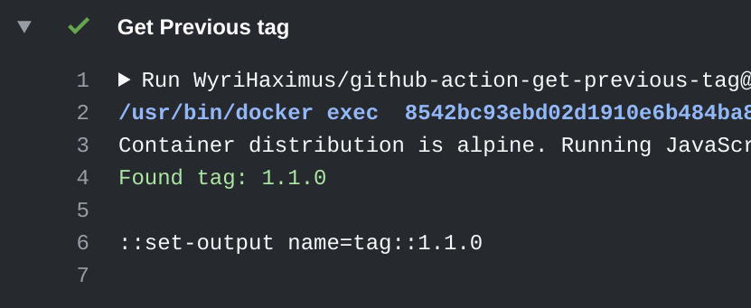

# Get previous tag

[](https://github.com/WyriHaximus/github-action-get-previous-tag/actions/workflows/ci.yml)
[](https://github.com/WyriHaximus/github-action-get-previous-tag/releases)


GitHub Action that gets the latest tag from Git



## Input

By default, this action will fail if no tag can be found, however, it accepts a `fallback` tag that will be used when no 
tag can be found. Keep in mind that when this action is used in a workflow that has no `.git` directory, it will still 
fail, and the fallback tag isn't used.

* `fallback`: `1.0.0`

## Output

This action has two outputs, `tag` for the found tag, or the fallback. And, `timestamp` as a UNIX Epoch timestmap for 
when the tag was created, or when no tag is found, and a fallback tag has be specific is provides the timestamp of 
action execution.

* `tag`: `1.2.3`
* `timestamp`: `123`

## Example

Find more examples in the [examples directory](./examples/).

The following example works together with the [`WyriHaximus/github-action-next-semvers`](https://github.com/marketplace/actions/next-semvers) and [`WyriHaximus/github-action-create-milestone`](https://github.com/marketplace/actions/create-milestone) actions.
Where it provides the previous tag from that action so it can supply a set of versions for the next action, which creates a new milestone.
(This snippet has been taken from the automatic code generation of [`wyrihaximus/fake-php-version`](https://github.com/wyrihaximus/php-fake-php-version/).)

```yaml
name: Generate
jobs:
  generate:
    steps:
      - uses: actions/checkout@v2.2.0
        with:
          fetch-depth: 0 # Required due to the weg Git works, without it this action won't be able to find any or the correct tags
      - name: 'Get Previous tag'
        id: previoustag
        uses: "WyriHaximus/github-action-get-previous-tag@v1"
        with:
          fallback: 1.0.0 # Optional fallback tag to use when no tag can be found
      - name: 'Get next minor version'
        id: semvers
        uses: "WyriHaximus/github-action-next-semvers@v1"
        with:
          version: ${{ steps.previoustag.outputs.tag }}
      - name: 'Create new milestone'
        id: createmilestone
        uses: "WyriHaximus/github-action-create-milestone@v1"
        with:
          title: ${{ steps.semvers.outputs.patch }}
        env:
          GITHUB_TOKEN: "${{ secrets.GITHUB_TOKEN }}"
```

## License ##

Copyright 2021 [Cees-Jan Kiewiet](http://wyrihaximus.net/)

Permission is hereby granted, free of charge, to any person
obtaining a copy of this software and associated documentation
files (the "Software"), to deal in the Software without
restriction, including without limitation the rights to use,
copy, modify, merge, publish, distribute, sublicense, and/or sell
copies of the Software, and to permit persons to whom the
Software is furnished to do so, subject to the following
conditions:

The above copyright notice and this permission notice shall be
included in all copies or substantial portions of the Software.

THE SOFTWARE IS PROVIDED "AS IS", WITHOUT WARRANTY OF ANY KIND,
EXPRESS OR IMPLIED, INCLUDING BUT NOT LIMITED TO THE WARRANTIES
OF MERCHANTABILITY, FITNESS FOR A PARTICULAR PURPOSE AND
NONINFRINGEMENT. IN NO EVENT SHALL THE AUTHORS OR COPYRIGHT
HOLDERS BE LIABLE FOR ANY CLAIM, DAMAGES OR OTHER LIABILITY,
WHETHER IN AN ACTION OF CONTRACT, TORT OR OTHERWISE, ARISING
FROM, OUT OF OR IN CONNECTION WITH THE SOFTWARE OR THE USE OR
OTHER DEALINGS IN THE SOFTWARE.
